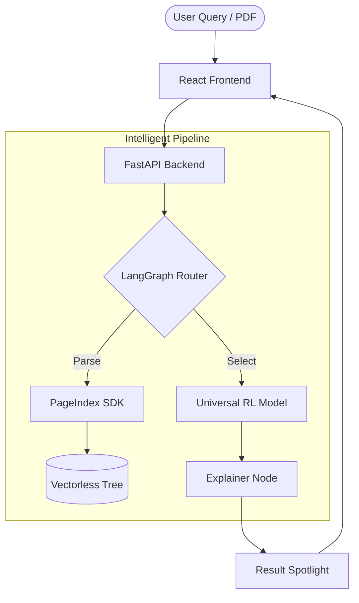

# 🛡️ InsureClear

### *The Vectorless RL Insurance Extraction Framework*

InsureClear is a state-of-the-art policy understanding engine that replaces traditional keyword search with an advanced **Reinforcement Learning (RL) Selector** and **Vectorless Document Trees**. It enables users to upload complex, unstructured PDFs and receive high-precision clause matches and AI-driven explanations instantly.

---

## 🚀 Experience the Pipeline

InsureClear is built on a **Dual-Agent Architecture** that bridges the gap between raw document structure and natural language reasoning.

- **PageIndex Parser**: Converts PDFs into hierarchical JSON trees (no vector noise).
- **LangGraph Router**: Dynamically classifies policy domains (Life, Health, Motor, etc.).
- **Universal RL Selector**: A 17MB high-performance cross-encoder that surfaces matched evidence with precision.
- **Explainability Layer**: Refines legal jargon into "Simple explanations" and "Scenario Logic."

---

## 🛠️ Tech Stack

| Layer | Technology | Purpose |
| :--- | :--- | :--- |
| **Frontend** | React + Vite | Premium UI/UX with smooth micro-animations |
| **Backend** | FastAPI | High-speed Python API with async support |
| **Orchestration** | LangGraph | State-managed agentic routing and decision logic |
| **Inference** | PyTorch / BERT | Cross-encoder models for clause selection |
| **Extraction** | PageIndex SDK | Structure-preserving PDF parsing |

---

## 🧬 Architecture Overview



---

## 📥 Installation & Setup

### 1. Prerequisites
- Python 3.11+
- Node.js 18+
- [Optional] Gemini API Key (for query pre-processing)

### 2. Backend Setup
```bash
cd backend
python -m venv venv
source venv/bin/activate  # venv\Scripts\activate on Windows
pip install -r requirements.txt
python -m uvicorn api_server:server --host 0.0.0.0 --port 8000 --reload
```

### 3. Frontend Setup
```bash
cd frontend
npm install
npm run dev
```

---

## 📖 Features at a Glance

### 🔍 Dynamic Multi-Domain Routing
The system automatically detects whether you're asking about a **Life**, **Health**, or **Motor** policy. It uses a specialized pre-processor to expand casual queries (e.g., "stolen car") into detailed insurance questions (e.g., "third-party liability for theft").

### 🌳 Vectorless Policy Trees
Unlike traditional RAG systems that "chunk and bury" text, InsureClear maintains the physical structure of the document. This ensures that every clause is returned with its parent headings and context intact.

### ⚡ Universal RL Selector
Our cross-encoder model is trained on thousands of insurance-specific query-clause pairs. It performs real-time ranking and surfaces the exact evidence needed to answer the user's question, bypassing the inaccuracies of cosine similarity.

---

## 🎨 Design Philosophy

InsureClear is designed for **Trust and Transparency**. 
- **Premium Aesthetics**: Dark glassmorphism, smooth gradients, and vibrant HSL palettes.
- **Visual Evidence**: The "Policy Tree" view lets users verify the source text themselves.
- **No Placeholders**: Every result is backed by a real clause from the document tree.

---

## 📜 License
*Custom Enterprise License - Developed for InsureClear Integration.*
