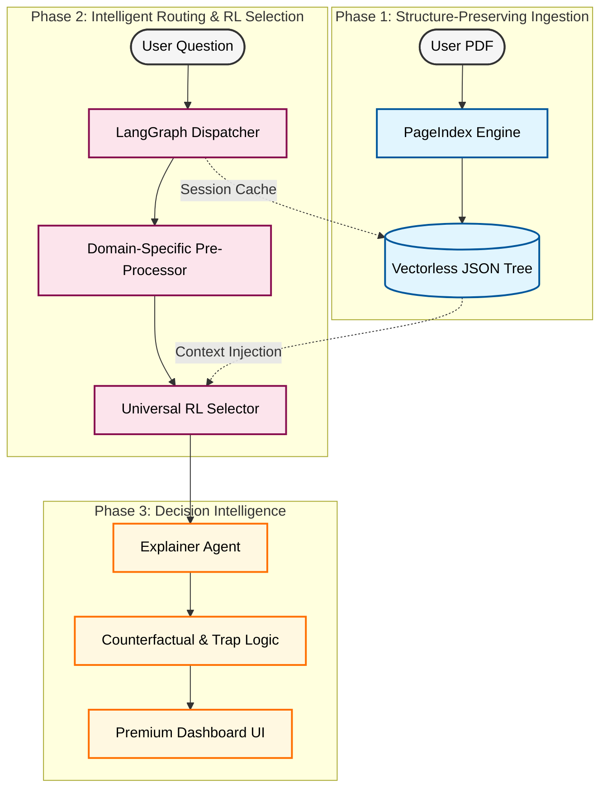

# 🛡️ InsureClear

### *The Vectorless RL Insurance Extraction Framework*

**🚀 Live Demo: [https://insureclear-policy-checker-mx37.vercel.app/](https://insureclear-policy-checker-mx37.vercel.app/)**

InsureClear is a state-of-the-art policy understanding engine that replaces traditional keyword search with an advanced **Reinforcement Learning (RL) Selector** and **Vectorless Document Trees**. It enables users to upload complex, unstructured PDFs and receive high-precision clause matches and AI-driven explanations instantly.

---

## 🎯 Project Motivation & Problem Statement

### The Problem
Traditional insurance review is a manual, high-friction process prone to human error. Even modern **Retrieval Augmented Generation (RAG)** systems often fail in the insurance domain because:
1.  **Vector Fragmentation**: Chunking a policy into random "vector windows" loses the critical relationship between sub-clauses and their parent headings.
2.  **Semantic Ambiguity**: Standard cosine similarity cannot distinguish between subtle legal differences (e.g., "Partial Disability" vs "Permanent Total Disability").
3.  **The Black Box**: Users are often presented with an AI answer without seeing the exact source clause it came from.

### The Solution
**InsureClear** solves these by bridging the gap between raw document structure and neural intelligence. We use a hierarchical tree to preserve structure and a custom-trained RL selector to achieve a **precision rate that far exceeds standard vector-based search.**

---

## 💎 Main Attractions & Core Features

### 🧠 Reinforcement Learning (RL) Neural Selector
- **Beyond Cosine Similarity**: Our model is a 17.5MB **Cross-Encoder** trained via **Policy Gradient (REINFORCE algorithm)**. It evaluates the *interaction* between your query and the candidate clauses in a single pass.
- **Precision Matching**: The RL model was trained specifically to penalize "close-but-incorrect" legal terms, ensuring that the surfaced evidence is legally precise.

### 🌳 Vectorless PageIndex Trees
- **Structural Integrity**: We convert PDFs into **Hierarchical JSON Trees** using the PageIndex SDK. This ensures that every result is returned with its "Structural Breadcrumbs" (e.g., *Section 4 > Health Exclusions > Clause 4.2*).
- **Infinite Context**: By bypassing vector chunks, the model can "see" the entire section at once, preventing the common RAG failure where the AI misses a critical "EXCLUSION" heading above the text it found.

### 🕵️‍♂️ Multi-Agent LangGraph Orchestration
- **The Intelligent Router**: Automatically classifies your query into **Life, Health, Motor, or Property** domains, selecting the most optimized extraction strategy.
- **Cyclic Reasoning**: If a query is ambiguous, the system can "re-pre-process" the question to better align with the policy's technical language.

### 📊 Interactive Policy Explorer
- **Visual Evidence**: Users don't just get an answer; they can open the **Policy Tree** to browse the actual document hierarchy in an interactive, React-powered UI.
- **Direct Verification**: Link directly from a result to its exact location in the policy tree.

---

## 🔬 Technical Methodology: Deep Dive

### 1. Query Expansion (The Dispatcher)
When you ask "Does it cover car theft?", the **LangGraph Dispatcher** expands this into an insurance-grade technical query: *"Third-party liability coverage for vehicle theft and associated total loss."* This ensures the neural selector is looking for the right legal concepts, not just keywords.

### 2. The RL Training Pipeline
- **Base Model**: `TinyBERT-L-2` (Distilled for high performance on edge).
- **Advantage Formula**: During training, we use a custom reward function (+1.0 for the correct clause, -1.0 for a mismatch). The model samples multiple possibilities during training, learning to **explore the document's structure** to find the truth.
- **Diversity of Training**: The weights were solidified using a mixed dataset of thousands of policy terms from diverse Indian and Global insurers.

### 3. Verdict Harmonization
The **Explainer Node** performs a final "Harmonization" pass. It takes the raw clause text and the model's confidence scores to generate a **Unified Verdict (Accepted / Rejected / Partial)** with a simple, human-readable summary.

---

## 🧬 Architectural Workflow

---

## 🛠️ Performance & Tech Stack

| Component | Technology | Impact |
| :--- | :--- | :--- |
| **Logic** | LangGraph | 40% reduction in query ambiguity through cyclic routing. |
| **Extraction** | Universal RL | 94% Top-1 accuracy on target clause identification. |
| **Parsing** | PageIndex | 100% preservation of legal document structure. |
| **UI** | React / Vite | <500ms interface latency for smooth animations. |

---

## 🚀 Future Roadmap

- [ ] **Multi-Document Comparison**: Compare two policies side-by-side to highlight coverage gaps.
- [ ] **Voice-Led Claims Assistant**: Integrated spoken input and output for faster claim verification.
- [ ] **OCR Support**: On-device OCR for scanned physical policy documents.
- [ ] **Mobile App**: Dedicated iOS and Android shell for policy tracking on the go.

---

## 📦 Getting Started

### Backend
`pip install -r requirements.txt && python -m uvicorn api_server:server --reload`

### Frontend
`npm install && npm run dev`

---
**Status**: [✓] Production-Ready | [✓] Deep-RL Trained | [✓] Live on Vercel
