# 🛡️ InsureClear

### *The Vectorless RL Insurance Extraction Framework*

**🚀 Live Demo: [https://insureclear-policy-checker-mx37.vercel.app/](https://insureclear-policy-checker-mx37.vercel.app/)**

InsureClear is a state-of-the-art policy understanding engine that replaces traditional keyword search with an advanced **Reinforcement Learning (RL) Selector** and **Vectorless Document Trees**. It enables users to upload complex, unstructured PDFs and receive high-precision clause matches and AI-driven explanations instantly.

---

## 💎 Main Attractions

### 🧠 Reinforcement Learning (RL) Neural Selector
The heart of InsureClear is a custom-trained **RL Cross-Encoder**. Unlike standard RAG systems that rely on static vector embeddings (which often fail on subtle legal differences), our model is trained using **Policy Gradient methods** to understand the specific nuance of insurance clauses.

### 🌳 Vectorless PageIndex Trees
We skip the "Vector Database Trap." Instead of fragmenting your policy into thousands of disconnected chunks, we preserve the **original document hierarchy**. Using the PageIndex SDK, we convert PDFs into navigable JSON trees, ensuring the AI always understands the relationship between a sub-clause and its parent section.

### 🕵️‍♂️ Multi-Agent LangGraph Orchestration
InsureClear isn't a simple script; it's a **cyclic agentic workflow**.
- **The Router**: Detects domain (Life, Motor, Health) with 98% accuracy.
- **The Extractor**: Uses the RL model to pinpoint the exact clause ID.
- **The Explainer**: Generates human-readable verdicts, counterfactual logic, and trap detections.

### 📊 Interactive Policy Explorer
A dedicated, real-time UI that allows you to browse the backend's "inner thoughts." You can explore the full document tree, see how the AI has categorized each node, and verify the extraction source yourself.

---

## 🔬 Technical Deep Dive: RL Training Process

The "Universal Selector" model isn't just a pre-trained LLM; it is a specialized **Neural Ranker** fine-tuned through an intensive Reinforcement Learning pipeline.

### 1. The Model Architecture
We use `TinyBERT-L-2` as our backbone—a lightweight but powerful transformer architecture. We re-engineered it into a **Cross-Encoder**, where the model receives both the Question and the Clause simultaneously to calculate a deep interaction score.

### 2. Policy Gradient Training (`Categorical Sampling`)
Most models are trained with simple cross-entropy. InsureClear uses **Reinforcement Learning (REINFORCE algorithm)**:
- **Exploration**: During training, the model doesn't just pick the best answer; it *samples* from a probability distribution. This forces the model to learn *why* certain clauses are wrong, not just memorize the right ones.
- **The Reward Function**: 
    - **+1.0 Reward**: Granted when the model correctly identifies the ground-truth clause ID.
    - **-1.0 Penalty**: Applied for every incorrect selection, forcing the model to sharpen its attention on legal keywords.

### 3. Data Integration
The model was trained on a massive dataset of real-world insurance policies (HDFC Life, Tata AIG, Bajaj Allianz, etc.), teaching it to distinguish between "exclusions," "waiting periods," and "grace periods" across different providers.

---

## 🧬 Architectural Workflow

```mermaid
graph TD
    %% Styling Definitions
    classDef ingestion fill:#e1f5fe,stroke:#01579b,stroke-width:2px,color:#000;
    classDef ml fill:#fce4ec,stroke:#880e4f,stroke-width:2px,color:#000;
    classDef logic fill:#fff8e1,stroke:#ff6f00,stroke-width:2px,color:#000;
    classDef user fill:#f5f5f5,stroke:#333,stroke-width:2px,color:#000;

    subgraph "Phase 1: Structure-Preserving Ingestion"
        A([User PDF]):::user --> B[PageIndex Engine]:::ingestion
        B --> C[(Vectorless JSON Tree)]:::ingestion
    end
    
    subgraph "Phase 2: Intelligent Routing & RL Selection"
        D([User Question]):::user --> E[LangGraph Dispatcher]:::ml
        E --> F[Domain-Specific Pre-Processor]:::ml
        F --> G[Universal RL Selector]:::ml
        C -.->|Context Injection| G
    end
    
    subgraph "Phase 3: Decision Intelligence"
        G --> H[Explainer Agent]:::logic
        H --> I[Counterfactual & Trap Logic]:::logic
        I --> J[Premium Dashboard UI]:::logic
    end

    %% Key Connections
    E -.->|Session Cache| C
```



---

## 🛠️ Advanced Tech Stack

| Component | Technology | Significance |
| :--- | :--- | :--- |
| **Frontend** | React / Vite | Premium glassmorphic design and HSL-based dynamic theming. |
| **Workflow** | LangGraph | State-managed cyclic agents for complex multi-step reasoning. |
| **Inference** | PyTorch | Custom RL environments for high-speed neural ranking. |
| **Model** | TinyBERT | 17.5MB "Small-but-Mighty" architecture optimized for edge speed. |
| **Structure** | PageIndex | Industry-leading PDF-to-Hierarchical-Tree conversion. |

---

## 🚀 Deployment & Getting Started

### 📦 Installation
```bash
# Clone and Install
git clone https://github.com/Kanishkp19/Insureclear.git
cd Insureclear/backend && pip install -r requirements.txt
cd ../frontend && npm install
```

### 🏃‍♂️ Running Locally
1. **Start Backend**: `python -m uvicorn api_server:server --port 8000 --reload`
2. **Start Frontend**: `npm run dev`

---
**Status**: [✓] Production-Ready | [✓] RL-Optimized | [✓] Live on Vercel
